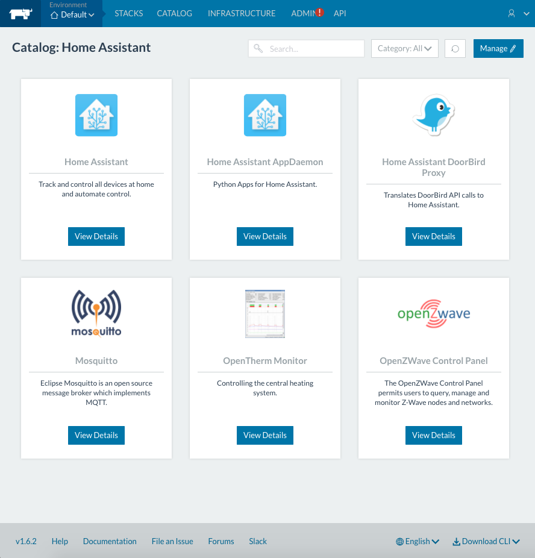

# Rancher Home Assistant Catalog

## Introduction
This Rancher catalog provides Home Assistant templates that make it easy to deploy Home Assistant and Add-ons on Docker.



## Prepare the host
Provision a Linux host with 64-bit Ubuntu 16.04, which must have a kernel of 3.10+. Please make sure the Linux host has at least 1GB memory. Install a supported version of Docker onto the host.

More info: http://rancher.com/docs/rancher/quick-start-guide/

I recommend a lightweight container OS like RancherOS and CoreOS.

More info: http://rancher.com/rancher-os/

## Install Rancher
Launching Rancher server (single container non-ha):
```bash
sudo docker run -d --restart=unless-stopped -p 8080:8080 rancher/server
```

More info see: http://rancher.com/docs/rancher/installing-rancher/installing-server/

Add custom host under **Infrastructure** -> **Hosts** -> **Add Host**.

## Add the Home Assistant catalog
Add this repo url as a new catalog in Rancher under **Admin** -> **Settings**.

More info: http://rancher.com/docs/rancher/catalog/

## Start Home Assistant

Your are now ready to launch a Home Assistant stack from the catalog under **Catalog** -> **Home Assistant**.

Happy ranching!

## Remarks

#### Home Assistant
If you are using a Aeon Labs Aeotec Z-Wave USB stick under RancherOS you probably need to load the cdc-acm module. 
This can be done by enabling kernel-extras:

```bash
sudo ros service enable kernel-extras
sudo ros service up kernel-extras
```

#### Mosquitto
Download the source from [mosquitto.org](https://mosquitto.org/) for more information about the mosquitto.conf, certificates and pwfile.

#### OpenTherm Monitor
More info on configuring the OpenTherm Monitor can be found here: [OTMONITOR.md](OTMONITOR.md)

## More info
- [Home Assistant](https://home-assistant.io/)
- [Home Assistant AppDaemon](https://home-assistant.io/docs/ecosystem/appdaemon/)
- [DoorBird Proxy](https://github.com/basschipper/homeassistant-doorbird-proxy)
- [OpenZWave Control Panel](https://github.com/OpenZWave/open-zwave-control-panel)
- [DoorBird](http://www.doorbird.com/)
- [Mosquitto](https://mosquitto.org/) 
- [OpenTherm Monitor](http://otgw.tclcode.com/otmonitor.html)